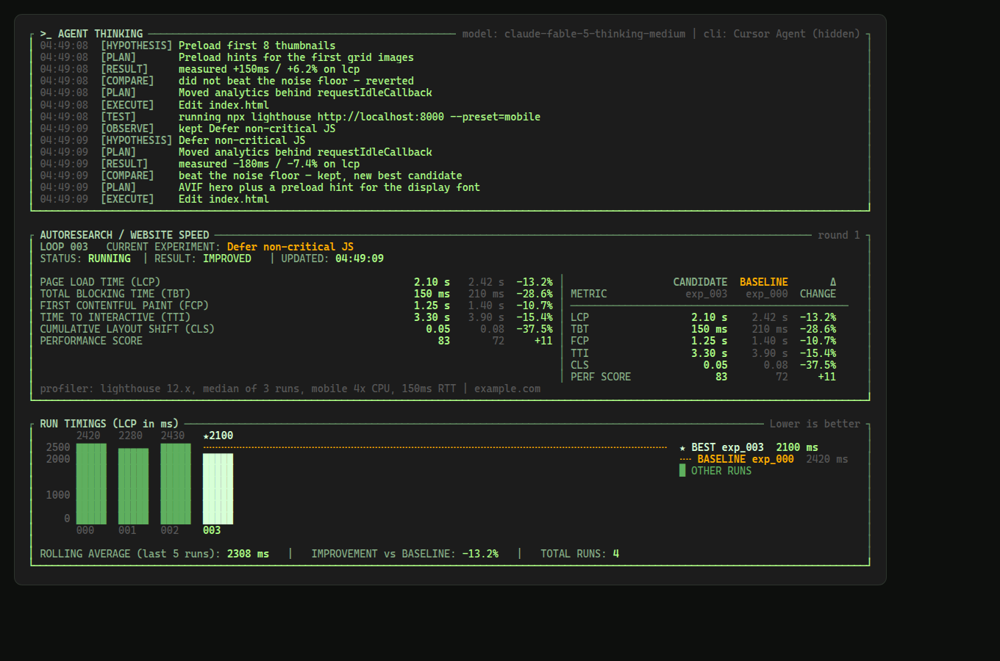

# Makefaster

**Makefaster** is an AI skill that runs an autoresearch loop to continuously
discover, test, and implement website performance improvements — plus the
marketing site and public leaderboards it reports to.

The site is vanilla HTML/CSS/JS — a single-page app built from Web Components,
no frameworks and no build step. The server is Go + MariaDB. The
`npx makefaster` CLI is zero-dependency Node.

```text
run.sh              start the server: cd backend && go run ./cmd/server
backend/            the Go server — APIs, migrations, static SPA hosting
frontend/           the SPA: index.html, css/, js/ (one component per file)
data/               the seed leaderboards, loaded into MariaDB on first boot
                    (empty — the public boards carry real submissions only)
packages/cli/       the npx makefaster CLI
packages/skill/     the loop skill the CLI hands to your agent
```

## `npx makefaster`

Run it inside a site repo:

```bash
npx makefaster            # or: npx github:jjcm/makefaster
```

What happens:

1. **Offers its own hosted model first, then the agent CLIs you already have.**
   **Makefaster** (`--cli makefaster`) needs nothing installed and no account:
   the model runs through `makefaster.dev`, which holds the OpenRouter
   credential and proxies chat completions, so the CLI never sees a key. Its
   model is pinned server-side to `stealth/ox-alpha`, so there is nothing to
   pick. Then the local ones, detected via PATH, well-known install locations
   (`~/.local/bin`, `~/.claude/local`, `~/.cursor/bin`, Homebrew…) and explicit
   env overrides (`CURSOR_AGENT_EXECUTABLE`, `CLAUDE_CODE_EXECUTABLE` /
   `BB_CLAUDE_CODE_EXECUTABLE`, `CODEX_EXECUTABLE`): Cursor Agent
   (`cursor-agent`/`agent`), Claude Code (`claude`), Codex (`codex`).
   makefaster never bundles or downloads a model.
2. **Asks you to pick** — the hosted option first and pre-selected, then
   whichever CLIs were actually found. Before anything runs.
3. **Asks you to pick a model** — five per provider, ranked by intelligence
   (see [Model picker](#model-picker)). `--model <id>` skips the picker, and
   the hosted provider skips it entirely because its model is pinned.
4. **Reuses the sign-in you already have.** For a local CLI, makefaster never
   runs a `login`, opens a browser, prints a device code, or injects an API key;
   a signed-out install fails with the CLI's own auth error and makefaster
   reports it in one line pointing at the native `login` command. For the hosted
   provider there is nothing to sign into — but a deployment with no credential
   configured is reported before the run starts, not three minutes into it.
5. **Imports the improvement checklist** — up to the top 50 categories from the
   live leaderboard, falling back to the technique catalog bundled at
   [`packages/cli/data/improvements.json`](packages/cli/data/improvements.json)
   while the public board is still filling up. Either way that ranked list is
   the order the loop works in.
6. **Runs the agent CLI hidden** with the loop skill
   ([`packages/skill/SKILL.md`](packages/skill/SKILL.md)): profile a
   user-felt metric (Lighthouse if available; cold + warm; median of ≥3 runs),
   then walk the imported checklist in rank order — one category per iteration,
   skipping what plainly does not apply — and finish with exactly five
   hypotheses of the agent's own. Measure each one, keep it if it beats the
   noise floor, revert otherwise. The other product's interface never draws and never
   prompts you (see [The native CLI stays hidden](#the-native-cli-stays-hidden));
   makefaster shows [its own dashboard](#the-dashboard) instead.
7. **Stops when the checklist and the five extras are done** — or earlier,
   after 5 consecutive misses (no serious improvement: ≥5% or ≥20 ms on the
   north-star metric, and FCP-only wins that regress LCP don't count) — then
   leaves the dashboard and shows the end screen with three
   questions:
   - **Loop more?** — resets the miss counter and continues.
   - **Submit stats to the Site leaderboard?** — your URL and favicon are
     displayed publicly with the measured LCP/TTI improvements, and the row
     links to the pull request the run was opened as when there is one.
   - **Submit anonymous improvements data?** — no URL; category names,
     descriptions, and deltas only. Novel improvements become new categories
     on the improvement leaderboard.

```text
Usage: npx makefaster [dir] [options]
  --cli <makefaster|cursor|claude|codex>
                                Skip the picker ("makefaster" = the hosted
                                model, no local CLI or key needed)
  --model <id>                  Skip the model picker (unused by --cli
                                makefaster, whose model is pinned)
  --url <example.com>           Site URL for the leaderboard submission
  --api <base>                  Leaderboard API base (default https://makefaster.dev)
  --improvements <path|url>     Override the checklist source
  --max-misses <n>              Stop after n straight misses (default 5)
  --no-tui                      Plain progress lines instead of the dashboard
```

Session state lives in `.makefaster/` in the target repo (auto-excluded from
git via `.git/info/exclude`): `SKILL.md` and `improvements.json` are what the
CLI hands the agent, `state.json` records the chosen provider, model and loop
limits, and the agent writes back `results.json` (the record the CLI reads) and
`thinking.log` (one tagged line per step, which is what the dashboard shows).

## The dashboard

While the agent works, makefaster owns the screen: an alternate-screen TUI with
no dependencies — raw ANSI, three panels, repainted from
`.makefaster/results.json` and `.makefaster/thinking.log`.



- **AGENT THINKING** — a timestamped line per step of the loop, each one a
  single tagged sentence: `INITIALIZING`, `TEST`, `CHECKLIST`, `SKIP`, `TRY`,
  `RESULT`, `EXTRA`, `DONE`. The agent writes them to `.makefaster/thinking.log`
  as each step begins (the contract is in `packages/skill/SKILL.md`), and
  `TRY`/`RESULT` lines are also derived from `results.json` so the numbers are
  measurements rather than narration. The hidden agent's protocol stream feeds
  this panel **nothing**: it is a tool-call transcript — `working`,
  `Read File`, `approved bash` — which says the agent is busy without ever
  saying what it is doing, and it buried the two lines a reader wanted. It is
  still consumed as the child's heartbeat.
- **AUTORESEARCH / WEBSITE SPEED** — the loop counter, the current experiment,
  and every metric the session measured (`lcpMs`, `tbtMs`, `fcpMs`, `ttiMs`,
  plus `cls` and `score` when the agent records them) as candidate vs baseline.
  Rows for metrics you did not measure are left out rather than shown empty.
- **RUN TIMINGS** — one bar per run on the north-star metric, with a dashed
  baseline, a star on the best run, and the rolling average. The schema stores
  per-iteration deltas rather than absolutes, so the bars are the baseline
  walked forward through the deltas — kept iterations move the running value,
  reverted ones do not.

`q` or Ctrl-C stops the round and restores the terminal; a resize re-renders.
The dashboard needs a TTY on both stdin and stdout — when output is piped, or
with `--no-tui` or `MAKEFASTER_NO_TUI=1`, makefaster prints a plain progress
line instead.

## The native CLI stays hidden

makefaster drives your agent CLI the way [bb](https://github.com/get-bb/bb)'s
provider bridges do: as a **non-TTY protocol child**, not as a terminal
application and not as a print-mode wrapper where a protocol exists. stdio is
always piped and never `stdio: "inherit"`; stdin is a pipe makefaster writes
protocol frames into, never your terminal — attaching it is what otherwise makes
these CLIs decide a human is present and start asking for login, workspace
trust, and per-tool permission.

| Agent | How makefaster drives it |
|---|---|
| Makefaster (hosted) | no child at all — the loop runs in this process against the server's model proxy, with makefaster's own tools |
| Cursor Agent | `cursor-agent --model <id> acp` — Agent Client Protocol over stdio |
| Claude Code | `@anthropic-ai/claude-agent-sdk` `query()`, which owns the CLI pipe itself; print mode is the zero-dependency fallback |
| Codex | `codex app-server` — JSON-RPC; the model rides `thread/start` |

`--model` is a *global* Cursor option, so it precedes the `acp` subcommand.
Cursor has no permission flag at all — `--force`, `--yolo` and `--always-approve`
belong to other agents — and neither does the app-server. So **makefaster answers
the child's permission requests itself**: ACP `session/request_permission`,
Claude's `canUseTool`, and Codex's three `requestApproval` methods. Without that
a hidden child would block forever on a question with no UI to ask it in.

The hosted provider is the exception to all of it: there is no vendor CLI to
hide, because there is no vendor CLI. makefaster holds the conversation itself
([`packages/cli/lib/agents/openrouter.js`](packages/cli/lib/agents/openrouter.js))
and gives the model a small, bounded toolset
([`tools.js`](packages/cli/lib/agents/tools.js)): list, read, write, edit, run a
shell command, and report a step to the dashboard. Every path is scoped to the
target directory — a path that resolves outside it is refused — every command is
non-interactive with a timeout, and every result is truncated before it becomes
prompt. The CLI sends no credential and names no model: both live on the server.

Claude Code is the one provider where a protocol client is a dependency rather
than a subprocess, so the Agent SDK is an optional peer: if it resolves,
makefaster uses it with bb's options — `pathToClaudeCodeExecutable`,
`settingSources: ["user","project","local"]` so `~/.claude` OAuth and settings
load, `permissionMode: "bypassPermissions"` plus
`allowDangerouslySkipPermissions`, and the prompt as an async iterable. If it
does not resolve, the fallback is print mode over piped stdio with the same
setting sources and permission mode, and the prompt written to stdin as a
stream-json frame rather than placed on argv.

Two details worth knowing: Claude Code refuses to skip permissions as root and
exits before the session starts, so as root makefaster sends
`--permission-mode acceptEdits` and leans on the tool-approval callback instead;
and Codex's `--full-auto` was removed from the CLI, which is part of why the
app-server — where the posture is `approvalPolicy: "never"` with a
`workspaceWrite` sandbox — is the path rather than `codex exec`.

### Credentials are reused, never supplied

makefaster never runs a `login` subcommand, never opens a browser, and never
prints a device code. It also **never injects an API key**: `ANTHROPIC_API_KEY`,
`CURSOR_API_KEY` and `OPENAI_API_KEY` are not set by makefaster, because an
injected key fights the OAuth credentials the CLI already stored and can itself
cause prompts. The child inherits your environment untouched and finds
`~/.claude`, `~/.cursor` and `CODEX_HOME`/`~/.codex` exactly as the native CLI
does. A key *you* set stays yours; makefaster only refuses to add one.

A signed-out install therefore fails with an auth-required error from the child
(or from the model-list probe, which needs the same account). That is the
expected signal: makefaster reports it in one line naming the native `login`
command and stops.

## Model picker

After you pick a provider, makefaster offers up to five models ranked by
intelligence. The ranking is the CursorBench 3.2 snapshot (captured 2026-07-16)
that [`jjcm/bb-plugin-autorouter`](https://github.com/jjcm/bb-plugin-autorouter/blob/main/benchmarks.ts)
carries as `CURSOR_BENCHMARKS`, reduced to the best score per model family.

The three CLIs do not share an id namespace, so the catalog does not either:

| | Cursor | Claude Code | Codex |
|---|---|---|---|
| 1 | `claude-fable-5-thinking-medium` — 70.5 | `claude-fable-5` — 70.5 | `gpt-5.6-sol` — 67.2 |
| 2 | `gpt-5.6-sol-medium` — 67.2 | `claude-opus-4-8[1m]` — 62.3 | `gpt-5.6-terra` — 64.9 |
| 3 | `gpt-5.6-terra-medium` — 64.9 | `claude-sonnet-5` — 61.5 | `gpt-5.6-luna` — 61.1 |
| 4 | `claude-opus-4-8-thinking-medium` — 62.3 | `claude-opus-5[1m]` — unranked | `gpt-5.5` — 58.4 |
| 5 | `claude-sonnet-5-thinking-medium` — 61.5 | `claude-opus-4-7[1m]` — unranked | *live list only* |

Cursor ids are **variants**: family plus reasoning effort plus an optional
`-fast` twin, and bb's primaries pin medium. Claude Code ids carry **no effort
suffix** — reasoning is a separate field — and a bracketed context parameter such
as `[1m]` is part of the id. Codex ids are plain families.

The score ranks the model *family*, not the exact variant, because that is what
the snapshot supports: it scores family-by-effort pairs and this keeps each
family's best. The picker says so rather than printing an effort next to an id
that pins a different one.

Where makefaster can ask the CLI what the account can actually run, it does, and
reconciles: `cursor-agent --list-models` for Cursor and `model/list` on the
app-server for Codex. Ids the CLI does not list are dropped, so an account
without Fable access is not offered Fable. Claude Code needs no probe — bb's
curated catalog is already exactly the five rows its own catalog filters to.

Only four OpenAI families are scored, so Codex shows four unless a live list
supplies a fifth. Families the snapshot does not score — Opus 5 and Grok 4.6 are
both newer than it — are offered but sort after every scored model and say they
are absent from the snapshot, rather than being given an invented number. The
catalog lives in [`packages/cli/lib/models.js`](packages/cli/lib/models.js).

`--model` also accepts an id that is not in this table and passes it straight
through, so a model released after this snapshot still works.

## Skills

| file | what |
|---|---|
| [`packages/skill/SKILL.md`](packages/skill/SKILL.md) | the **operational loop** the CLI hands to your agent: profiling rules, one-hypothesis iterations, the keep/revert bar, the 5-miss stop rule, and the `results.json` contract |
| [`skill/SKILL.md`](skill/SKILL.md) | the **canonical technique catalog** — the updated [jjcm/speedupskill](https://github.com/jjcm/speedupskill) `SKILL.md` (measured wins, traps, keep/ditch discipline). Canonical here because a PR to that repo could not be opened from this environment; see [`skill/README.md`](skill/README.md) |

## Run locally

You need Go 1.22+ and a MariaDB on `127.0.0.1:3306`. If you have Docker, the
compose file is the whole setup:

```bash
cp env.example .env       # every value is already the default
docker compose up -d      # MariaDB, plus the throwaway test schema
./run.sh                  # http://localhost:8787
```

`run.sh` is `cd backend && exec go run ./cmd/server`. On start the server
applies the goose migrations, seeds the leaderboards from `data/` if the tables
are empty, and serves the SPA plus both APIs from the one process. Restarting
after a schema change is the whole deploy story — there is no separate migrate
step.

The committed `data/` seed is empty, so a fresh database gives you empty boards.
To browse the SPA with a full one, generate a synthetic pair and point `SEED_DIR`
at it:

```bash
node scripts/generate-data.mjs --out-dir /tmp/makefaster-demo
SEED_DIR=/tmp/makefaster-demo ./run.sh
```

Without Docker, point `MARIADB_DSN` at any MariaDB or MySQL and create the
schema first:

```bash
mariadb -e 'CREATE DATABASE makefaster CHARACTER SET utf8mb4 COLLATE utf8mb4_unicode_ci'
```

### Configuration

Every variable has a working default, so an empty `.env` boots. See
[`env.example`](env.example) for the annotated list.

| env var | default | meaning |
|---|---|---|
| `PORT` | `8787` | listen port |
| `HOST` | `0.0.0.0` | bind address |
| `MARIADB_DSN` | `root:root@tcp(127.0.0.1:3306)/makefaster?parseTime=true` | database; `parseTime=true` is required |
| `MIGRATIONS_DIR` | `./internal/db/migrations` | goose migrations, applied on start |
| `SEED_DIR` | `../data` | seed JSON, read only into empty tables; the committed default is empty |
| `FRONTEND_DIR` | `../frontend` | SPA static root |
| `MAKEFASTER_EMBEDDINGS_API_KEY` / `OPENAI_API_KEY` | — | switches the embedder from local to a remote OpenAI-compatible endpoint |
| `MAKEFASTER_EMBEDDINGS_MODEL` | `text-embedding-3-small` | remote embedding model |
| `MAKEFASTER_EMBEDDINGS_BASE_URL` | `https://api.openai.com/v1` | any OpenAI-compatible host |
| `MAKEFASTER_MATCH_THRESHOLD` | 0.3 local / 0.55 remote | cosine fold-vs-create cutoff |

## The SPA

One shell, three History API routes, no build step: plain ES modules and
`customElements.define()`, one component per file in `frontend/js/`.

| Route | Component |
|------|------|
| `/` | `<landing-page>` |
| `/site-leaderboard` | `<site-leaderboard-page>` |
| `/improvement-leaderboard` | `<improvement-leaderboard-page>` |

`<site-header>`, `<geo-row>` and `<spec-footer>` are the pieces all three pages
share. Every component renders into **light DOM**, not a shadow root, so the
single `css/style.css` keeps styling its markup — which is why the host
elements are declared `display: block`. The old `*.html` URLs 301 to their
route, and unknown app paths are served the shell so a hard refresh works.

## Data APIs

Served by the Go process, reading the live MariaDB tables rather than the
committed seed files. Both boards are built from real submissions only, so they
start empty and grow as loops report results:

| Endpoint | What | Wrapper |
|----------|------|---------|
| `GET /data/sites.json` | live site rows, one per site per load mode | `MakefasterAPI.getSites()` |
| `GET /data/improvements.json` | live ranked categories | `MakefasterAPI.getImprovements()` |
| `GET /api/health` | `{ ok, embedder, threshold }` | — |
| `POST /api/submit-site` | `{ url, favicon?, name?, prUrl?, genericKeepPct?, siteSpecificKeepPct?, lcpBefore?, lcpRaw, lcpDelta, ttiBefore?, ttiRaw, ttiDelta, mode: cold\|warm }` — upserts the site's row; URL + favicon shown publicly, `name` reduced to the product's own name, `prUrl` (or `pr`) linked from it | `MakefasterAPI.submitSite(payload)` |
| `POST /api/submit-improvements` | `{ improvements: [{ name, description?, deltaMs?, deltaPct? }] }` — anonymous; names and descriptions are normalized to generic techniques and embedding-matched into categories | `MakefasterAPI.submitImprovements(payload)` |
| `POST /api/openrouter/v1/chat/completions` | OpenAI-compatible chat completions for the CLI's hosted provider, proxied to OpenRouter under the server's own credential | — |

Each metric has both ends of the run: `lcpRaw`/`ttiRaw` are the measurement
after the last kept change, `lcpBefore`/`ttiBefore` the pre-loop baseline, and
the deltas the percentage between them, negative = faster. The two `*Before`
fields are optional — a client that omits them has the baseline recovered from
the delta (`before = after / (1 + delta/100)`).

A row's name is the **product's**, not the deployment's: submitted names have
described one person's copy of the product — `Dify Studio (self-hosted)`,
`n8n (self-hosted editor, jjcm/n8n fork)`, `Langflow (fork)` — so ingest strips
parentheticals, fork and self-hosted qualifiers, jjcm references, and a trailing
UI-surface word (`dashboard`, `editor`, `studio`), leaving `Dify`, `n8n` and
`Langflow`. Matching is whole-word, so `Forkify` and `Editorial` are untouched.
The rule is documented for submitters in `packages/skill/SKILL.md`.

`prUrl` is the pull request the run's kept changes were opened as. The site
leaderboard links the row's name to it, so the board can show the diff behind a
percentage; a row without one is plain text and the key is left off the JSON.

`genericKeepPct` / `siteSpecificKeepPct` say how the run's kept changes divided
between techniques any site could reuse and findings that could only ever have
mattered to that product — both are real speedups, but only the first belongs on
the improvement board, and the CLI submits only those as categories. The two are
complementary, so sending either one is enough; both zero (or both omitted)
means no split was reported, and the board then shows none rather than a
0%. Rows submitted before the fields existed are left blank: the split is not
recoverable from what was stored.

`POST /api/submit-site` answers `201` when it created the row and `200` when it
folded a new run into an existing one, both as `{ ok, created, row }`; invalid
payloads come back as `400 { ok: false, errors: [...] }`. Writes are serialized,
POSTs are rate limited to 60/minute/IP, bodies are capped at 256 KB, and every
response carries permissive CORS so the SPA can be hosted anywhere.

### The hosted model proxy

`POST /api/openrouter/v1/chat/completions` is what the CLI's `makefaster`
provider runs on. It exists so that a machine with none of the three agent CLIs
installed can still run the loop: the server holds `OPENROUTER_API_KEY`, the CLI
holds a URL, and chat completions are forwarded on its behalf. **The credential
never leaves the box** — it is in no response body, no error string and no log
line, and responses are scrubbed on the way out as a backstop.

Which makes it the one endpoint here that spends money per request, so it is
deliberately narrow ([`backend/internal/inference`](backend/internal/inference)):

- the **model is pinned** to `stealth/ox-alpha` server-side. Whatever the client
  sends is discarded, so nobody can spend the credential on a model nobody chose;
- **`max_tokens` is clamped** (8192) and **streaming is refused**, so one request
  cannot run away;
- a request with **no messages is rejected** before it costs anything, as is any
  `api_key`/`authorization` field a client tries to smuggle upstream;
- it is **rate limited per IP on its own budget** (30/minute), separate from the
  leaderboard writes, and the 429 says why;
- with **no credential configured it answers 503** with the fix, rather than
  failing obscurely — and `GET /api/health` reports
  `inference: { available, model }` so the CLI can say so before a run starts.

Set the key at deploy time; there is none in this repo, and the tests use an
`httptest` upstream and a placeholder string.

### Embeddings

`POST /api/submit-improvements` first reduces each submitted name to a **generic
technique name**, then matches it. The board is a catalog of techniques, so a
name that only describes one repo — `Lazy-load Hidden 262KB Changelog
Rocket.gif` — would become a permanent row of one. Normalization strips
parentheticals, byte sizes and file names, folds the `lazy-load <one widget>`
family into five buckets (components, unseen images, third-party SDKs,
analytics, data fetches), and maps other known families onto their technique
name. A name that already matches a category on the board wins over any rule.
The rule is documented for submitters in `packages/skill/SKILL.md`.

The **description** a row shows goes through the same treatment, because a
technique name over one repo's changelog — `Reduce Font Payload` / "Playfair
Display cut from 4 weights x 2 styles…" — tells the next site nothing it can
act on. A submitted description is read for the things that can only mean one
repo (module and file names, route paths, CSS declarations, byte sizes and other
measurements, known product nouns, past-tense changelog voice) and, if any turn
up, replaced: with the catalog's own line for the technique when the board names
one, otherwise with the submission minus those tokens, otherwise with a
placeholder. A fold keeps the row's existing description — a fold is one more
site reporting the same technique, not a re-titling — and only upgrades it when
the row still carries a site-specific one.

The normalized name then decides the fold: a category whose name carries the
same significant word stems folds without consulting the embedder, and anything
else is embedded (name doubled, then the description) and compared to every
current category by cosine similarity — at or above the threshold it folds into
that category's running averages, below it becomes a new category. Entries in
one payload are processed in order against the growing list, so two similar
novel entries create one category.

Two backends, picked by whether an API key is set:

- **local (default)** — a deterministic feature-hashing embedder: stemmed word
  unigrams and bigrams plus character 3/4-grams, signed and hashed into 4096
  L2-normalized dimensions. No model download, no GPU, no network, no key.
  Threshold **0.3**, pinned by the paraphrase/novel separation test.
- **remote (optional)** — any OpenAI-compatible `/v1/embeddings` endpoint.
  Threshold **0.55**. A failure falls the whole request back to local, so every
  comparison stays inside one embedding space.

Nothing is persisted in embedding space: the categories are re-embedded on each
request, so the backend can be switched at any time.

Row shapes:

```js
// site leaderboard — one row per site per load mode.
// prUrl is the pull request the run was opened as, and is absent when the row
// has none — the board links the site name to it when it is there. The two keep
// percentages are absent together when the run reported no split.
{ "name": "Example", "url": "example.com", "favicon": "https://…",
  "prUrl": "https://github.com/jjcm/example/pull/1",
  "genericKeepPct": 80, "siteSpecificKeepPct": 20,
  "lcpBefore": 2791, "lcpRaw": 1842, "lcpDelta": -34,
  "ttiBefore": 4148, "ttiRaw": 2945, "ttiDelta": -29,
  "mode": "cold", "tests": 6, "measuredAt": "2024-05-12T14:15:00.000Z" }

// improvement leaderboard — one row per improvement category
{ "rank": 1, "name": "Gzip / Brotli Compression",
  "description": "Enable or improve text compression",
  "count": 286, "avgImprovementMs": -497, "avgImprovementPct": -28.6,
  "icon": "gzip" }
```

`rank` is **times improved, descending** — how often a technique has worked
across sites, which is what makes it worth trying next. Ties break on the
biggest average improvement, then the name. Both boards let you re-sort in the
browser: the improvement board on times improved and average improvement, the
site board on either end of LCP and TTI plus the improvement between them.

`measuredAt` is always ISO-8601 with milliseconds, in UTC.

Seed files only matter on a fresh database — once the tables hold rows the
server never reads them again. Back up the live boards with `mysqldump`.

`scripts/generate-data.mjs` builds a synthetic pair of files in these shapes
(deterministic, seeded) for filling a local database. It requires an explicit
`--out-dir` and refuses to write into `data/`, so a regeneration cannot put
invented sites back on the public boards.

## Deploying

One Go binary plus the `frontend/` directory and a MariaDB:

```bash
cd backend && go build -o /usr/local/bin/makefaster-server ./cmd/server
```

Migrations run on start, so a deploy is build, replace, restart. The process
needs `MARIADB_DSN`, `FRONTEND_DIR`, and `MIGRATIONS_DIR` pointing at the
shipped copies of `frontend/` and `backend/internal/db/migrations/`. Put a
TLS-terminating proxy (Caddy/nginx/Cloudflare) in front and point the domain at
it — the `npx makefaster` CLI submits to `https://makefaster.dev` by default,
and elsewhere with `--api` or `MAKEFASTER_API_BASE`.

Hosting the SPA separately (a static CDN plus a deployed API) also works: set
the API origin before the app module loads, and route `/data/*.json` to the
server too so the boards stay live.

```html
<script>window.MAKEFASTER_API_BASE = "https://api.your-host.dev";</script>
```

## Tests

```bash
npm test                                    # CLI: detection, args, payloads,
                                            # protocol children, catalog, dashboard
cd backend && go test ./...                 # server, embedder, categorization
```

The CLI suite spawns real protocol children — a stub agent speaking ACP and one
speaking the codex app-server dialect — and asserts on the frames they receive,
so the argv, the handshake, and the permission answers are proven rather than
described. It needs no network, no database, and no signed-in agent CLI.


The MariaDB-backed server tests skip unless a throwaway schema is named, so
`go test ./...` passes on a machine with no database. To run them:

```bash
cd backend
MAKEFASTER_TEST_MARIADB_DSN='root:root@tcp(127.0.0.1:3306)/makefaster_test?parseTime=true' \
  go test ./...
```

They drop the tables and re-migrate, so the schema is created from scratch every
run. Coverage: seed-from-file against a one-site, one-category fixture in
`backend/internal/http/testdata/seed/`; a fresh migrate against the committed
(empty) seed leaving both endpoints serving `[]`; `201` then `200` on a repeated
submission; the board surviving a process restart; the health payload;
static/SPA fallback and legacy redirects; CORS; and the body cap. They also run
the two board migrations against the live rows they were written for: the
generic-name rename (00002) and the generic-description backfill (00004), the
latter both forwards and rolled back.

The categorization and embedding tests need a realistic board to match against,
so they read `backend/testdata/categories.json` — a frozen 50-row fixture that
is test-only and never served. `backend/testdata/category_descriptions.json` is
the other half: the description every live row carried before migration 00004
and the technique blurb that replaced it, which is what keeps the migration, the
ingest catalog, and the rollback in agreement. The embedding tests pin the local match threshold
and the exact similarity scores the Node implementation produced against it, so
the fold-vs-create boundary cannot drift.

## Easter egg: concrete backgrounds

Press **C** anywhere (outside of a text input) to cycle through five seamless
concrete background tiles (`frontend/assets/textures/concrete-0*.webp`): pale poured,
board-formed, fine grit, polished cement, and weathered slab. The selected
tile persists in `localStorage`.

## Assets

Generated via the DiffUI build API and stored locally (no remote hotlinks):

- `frontend/assets/logo.svg` — image-to-SVG of the brand-splash mark (bolt in a circular arrow)
- `frontend/assets/icons/*.svg` — text-to-SVG pictograms (research, experiment, repeat, tree, bolt, gzip)
- `frontend/assets/textures/concrete-0[1-5].webp` — five seamless 1024×1024 concrete tiles

Simple glyphs (crosshairs, plus marks, arrows, chevrons, standard UI icons) are
hand-authored inline SVG.
